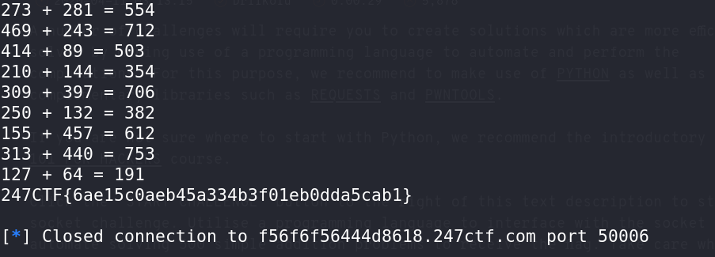

# Tips and Tricks - CTF Challenge Writeup

## Challenge Information
- **Name**: Tips and Tricks
- **Points**: 50
- **Category**: Beginner

## Objective
The objective of the "Tips and Tricks" CTF challenge is to solve 500 mathematical questions presented to you by connecting to an instance. The challenge is designed to test your ability to programmatically solve problems and submit the answers efficiently.

## Solution
Solving the "Tips and Tricks" challenge involves setting up a programmatic approach to efficiently solve the mathematical questions presented by the instance. Here's a step-by-step guide on how I tackled this task:

1. **Connect to the Provided Instance**: Begin by connecting to the instance provided. You will discover that you need to solve 500 mathematical questions to complete the challenge.

2. **Choose a Programmatic Approach**: Instead of manually solving each question, I opted for a programmatic approach to save time and effort.

3. **Utilize pwntools**: To connect to the instance and interact with it programmatically, I used a tool called pwntools. Pwntools is a Python library for various CTF tasks, including exploiting and connecting to remote services.

4. **Use eval() to Evaluate Questions**: With pwntools in place, I wrote a Python script that would connect to the instance and evaluate each mathematical question using the `eval()` function. This allowed me to quickly calculate the answers.

5. **Submit Answers to the Server**: After calculating each answer, I submitted it to the server using the established connection. This process continued for all 500 questions.


    ```python
    from pwn import * 

    with remote("f56f6f56444d8618.247ctf.com", 50006) as connection: 
      connection.readline()
      connection.readline()

      for i in range(500):
        question = connection.readline().decode().replace("\r", "")[22:-2]
        question_answer = eval(question)

        print(f"{question} = {question_answer}")

        payload = (str(question_answer) + "\r\n").encode()

        connection.sendline(payload)
        connection.readline()

      print(connection.readline().decode().replace("\r", ""))
    ```

6. **Achieve 500 Correct Answers**: By repeating the evaluation and submission steps for all 500 questions, I managed to solve the required number of questions and successfully completed the challenge.


    

By following these steps and using pwntools and `eval()` to programmatically solve the mathematical questions, you can efficiently obtain the required number of correct answers.

## Flag
The flag is in the format `247CTF{XXXXXXXXXX}`. After successfully solving all 500 questions and submitting the answers, you will receive the flag as a reward for your efforts.
