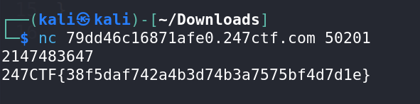

# An Impossible Number - CTF Challenge Writeup

## Challenge Information
- **Name**: An Impossible Number
- **Points**: 95
- **Category**: Miscellaneous

## Objective
The objective of the "An Impossible Number" CTF challenge is to understand and exploit integer overflow in C programs. Participants must recognize the limitations of signed integers in C and utilize this knowledge to input a specific number that leads to a flag. This challenge falls under the Miscellaneous category.

## Solution
To successfully complete the "An Impossible Number" challenge, participants need to grasp the concept of integer overflow in C programs and use this knowledge to input the correct value. Here is a step-by-step guide on how I approached and solved this challenge:

1. **Understanding Integer Overflow**:
   - This challenge centers around integer overflow in C programs.
   - Integer overflow occurs when an arithmetic operation on integers results in a value that exceeds the maximum representable value for that data type.
   - In C, integers are signed by default, meaning they can represent both positive and negative numbers.
   - The maximum value that a signed integer can store is 2,147,483,647.

2. **Leveraging Integer Overflow**:
   - To exploit integer overflow in this challenge, input the value 2,147,483,647.
   - This number is the largest positive value that a signed integer in C can store.
   - The reason for this is that a signed 32-bit integer has 2,147,483,647 positive values, 2,147,483,647 negative values, and one zero, totaling 4,294,967,295 values in total.
   - By inputting this number into the challenge (e.g., through a netcat instance), you can trigger integer overflow.

3. **Flag Retrieval**:
   - After entering 2,147,483,647, the challenge will respond by providing the flag.
   - The flag should be presented in the format `247CTF{XXXXXXXXXX}`.

      

The key to solving the "An Impossible Number" challenge lies in understanding and exploiting integer overflow in C programs. By inputting the value 2,147,483,647, participants can trigger an overflow condition that leads to the flag's retrieval.

## Flag
The flag for this challenge is in the format `247CTF{XXXXXXXXXX}`. Participants should follow the provided steps to input the specific number that triggers integer overflow and allows them to obtain the flag.
