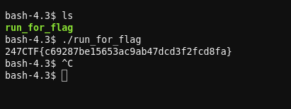

# The Text Editor Jail - CTF Challenge Writeup

## Challenge Information
- **Name**: The Text Editor Jail
- **Points**: 80
- **Category**: Miscellaneous

## Objective
The objective of the "The Text Editor Jail" CTF challenge is to escape from a restricted text editor environment and gain access to a terminal to execute commands. By exploiting the capabilities of the VIM text editor, participants must break free from the limitations and retrieve the hidden flag.

## Solution
Solving the "The Text Editor Jail" challenge involves leveraging the VIM text editor's powerful features to escape the restricted environment and gain access to a terminal for command execution. Here's a step-by-step guide on how I approached this task:

1. **Access the Web-Based Text Editor**: Upon starting the challenge instance, I found myself in a web-based text editor environment. Additionally, I noticed the presence of VIM, a popular text editor with advanced features.

2. **Recognize VIM's Capabilities**: VIM is known for its extensive capabilities, including the ability to execute commands on the terminal. This knowledge is essential for progressing in the challenge.

3. **Enter Command Mode in VIM**: In VIM, you can enter command mode by typing ":" followed by the desired command. This feature allows you to execute a wide range of commands within the text editor.

4. **Set the Shell**: To escape the text editor environment and gain access to the machine's terminal, I entered the following command in VIM:
      ```bash
      :set shell=/bin/bash
      ```
   1. This command sets the shell for the VIM instance to `/bin/bash`, effectively configuring VIM to use the Bash shell.


    

5. **Access the Terminal**: After setting the shell, I executed the following command in VIM:
      ```bash
      :shell
      ```
   1. This command opened a terminal within the VIM environment, providing a familiar command line interface for interaction.


    

6. **Execute the Program**: Once in the terminal, I located and ran the program as instructed by the challenge. This program led to the discovery of the flag.


    

By following these steps and exploiting VIM's capabilities, I successfully escaped the text editor jail, accessed the terminal, and retrieved the hidden flag.

## Flag
The flag is in the format `247CTF{XXXXXXXXXX}`. After gaining access to the terminal within VIM and executing the program as indicated, you will uncover the flag and be able to submit it.
