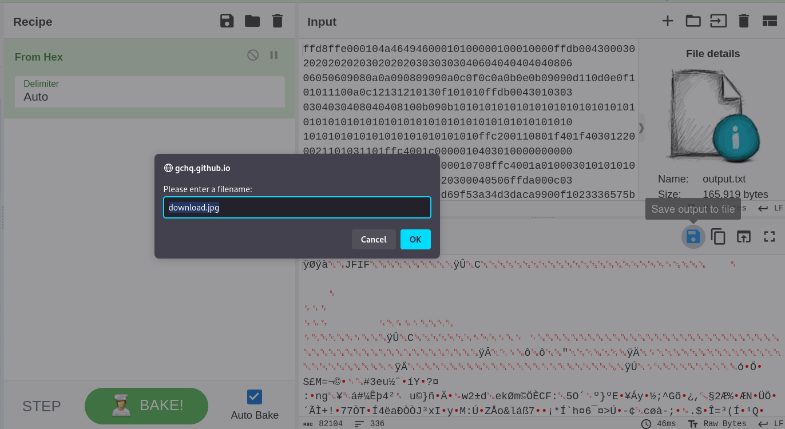

# Error Reporting Protocol - CTF Challenge Writeup

## Challenge Information
- **Name**: Error Reporting Protocol
- **Points**: 145
- **Category**: Networking

## Objective
The objective of the "Error Reporting Protocol" CTF challenge is to extract and decode data from a provided PCAP file containing ICMP packets. By analyzing the packets and understanding their content, participants must uncover the hidden image within the ICMP reply packets and retrieve the flag.

## Solution
Solving the "Error Reporting Protocol" challenge involves extracting and decoding data from ICMP packets within the provided PCAP file. To achieve this, you can use the `tshark` tool to extract the data from ICMP reply packets and then decode it to reveal the hidden image. Here's a step-by-step guide on how I approached this task:

1. **Open the Provided PCAP**: Begin by opening the provided PCAP file using a tool such as Wireshark or `tshark`. This PCAP contains a series of ICMP packets.

2. **Analyze ICMP Packets**: Upon examination, you will observe that all the packets in the PCAP are ICMP packets. Furthermore, these ICMP packets are presented in batches, such as 1/1000, 2/1000, and so on.


    

1. **Identify JFIF Header**: Within the first ICMP reply packet of the batch, you will notice the presence of a JFIF header. This header is indicative of image data, hinting that the goal is to extract and decode an image from these packets.

2. **Extract Data Using tshark**: To extract the data from ICMP reply packets, you can use the `tshark` command with the following parameters:
   1. This command filters for ICMP reply packets (type 0) and extracts the data from these packets into an `output.txt` file.
        ```bash
        tshark -nr <pcap file> -Y 'icmp.type == 0' -Tfields -e data.data > output.txt
        ```


    

3. **Decode the Data**: Now that you have the data in the `output.txt` file, you can decode it using various methods. One approach is to use CyberChef, an online tool for data manipulation and decoding. Upload the `output.txt` file to CyberChef and apply the necessary operations to decode it.


    

4. **Alternative Python Approach**: If you prefer to decode the data using Python, you can follow this script:
      ```python
      with open('output.txt', 'r') as file:
          hex_data = file.read()

      jpeg_data = bytes.fromhex(hex_data)

      with open('output.jpg', 'wb') as jpg_file:
          jpg_file.write(jpeg_data)
      ```

5. Retrieve the Flag: After decoding the data, you will reveal the hidden image. Examine the image to find the flag, which is presented in the format 247CTF{XXXXXXXXXX}.

By following these steps and using tshark or Python to extract and decode the data from ICMP reply packets, you can successfully complete the "Error Reporting Protocol" challenge and retrieve the flag.