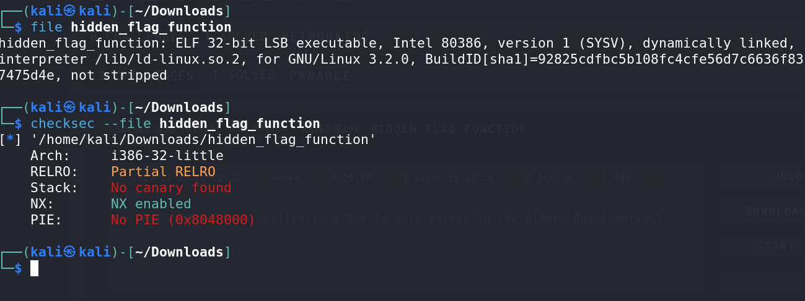

# Hidden Flag Function - CTF Challenge Writeup

## Challenge Information
- **Name**: Hidden Flag Function
- **Points**: 130
- **Category**: Pwnable

## Objective
The objective of the "Hidden Flag Function" CTF challenge is to exploit a 32-bit binary and uncover a hidden flag function. By identifying and exploiting a buffer overflow vulnerability in the binary, participants must execute a carefully crafted payload to reveal the flag.

## Solution
Solving the "Hidden Flag Function" challenge involves identifying and exploiting a buffer overflow vulnerability in a provided binary. To achieve this, participants need to perform some initial reconnaissance and then craft a classic buffer overflow exploit. Here's a step-by-step guide on how I approached this task:

1. **Initial Reconnaissance**:
   - Given a binary file, the first step is to perform initial reconnaissance. We can use various tools to gather information about the binary.
   - Use the `file` command to determine the file format of the binary. This provides insight into its type.
   - Employ a tool like `checksec` to analyze the binary's security features and identify potential vulnerabilities.

2. **Analysis of Binary**:
   - In our analysis, we discover that the binary is a 32-bit executable with several characteristics that make it exploitable.
   - It lacks Position Independent Executable (PIE) and does not use a Canary, making it more susceptible to buffer overflows.


      

3. **Use of Ghidra**:
   - Analyzing the binary in Ghidra, we identify the usage of `scanf`. The presence of `scanf` often signifies a potential buffer overflow vulnerability.


      

4. **Local Testing**:
   - To determine the buffer overflow offset, we conduct local testing. By supplying various inputs, we identify the point at which the program crashes. In this case, we find that it crashes at the string `taaa`, which corresponds to an offset of 76.


      
      

5. **Locate the Hidden Flag Function**:
   - To locate the hidden flag function, we use a debugger such as GDB. Running the binary with GDB, we obtain information about the functions in the binary by using the command `info functions`.


      

6. **Exploit Development**:
   - Armed with the knowledge of the buffer overflow offset and the address of the hidden flag function, we can craft a classic buffer overflow exploit.
   - Using Python and a library like pwntools, we develop a script that constructs the payload, targets the buffer overflow, and redirects program execution to the hidden flag function.

      ```python
      from pwn import * 

      padding = b"A" * 76
      win = p32(0x08048576)

      with remote("e2b147966b741b27.247ctf.com", 50388) as connection:
         connection.sendlineafter(b" ", padding + win)
         print(connection.clean(1).decode())

      ```

By following these steps, participants can successfully exploit the buffer overflow vulnerability and execute the hidden flag function, leading to the retrieval of the flag.

## Flag
The flag is in the format `247CTF{XXXXXXXXXXXXX}`. Once you have successfully executed the hidden flag function using the buffer overflow exploit, you will uncover the flag and be able to submit it.

