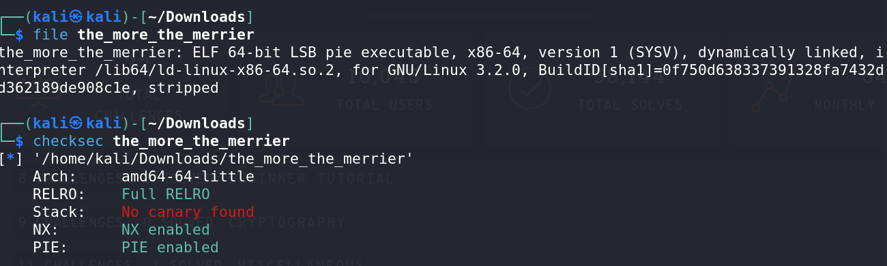
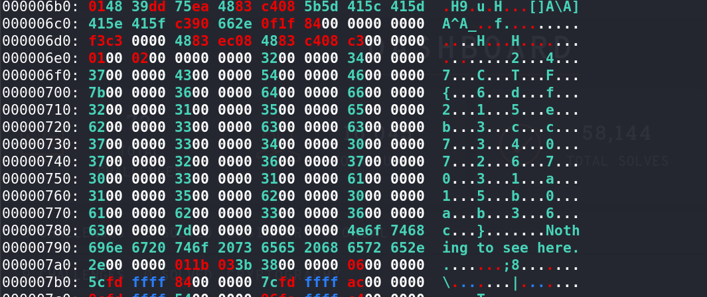

# The More The Merrier - CTF Challenge Writeup

## Challenge Information
- **Name**: The More The Merrier
- **Points**: 95
- **Category**: Reversing

## Objective
The goal of the "The More The Merrier" CTF challenge is to uncover the hidden flag from a given binary file. This challenge falls under the Reversing category, where participants need to analyze the binary and discover the flag through reverse engineering.

## Solution
Solving the "The More The Merrier" challenge involves analyzing a binary file and extracting the flag. Here's a step-by-step guide on how I approached this task:

1. **Basic Information Check**:
   - Start by examining the basic information about the binary file.
   - Use tools like `file` and `checksec` to gather information about the binary's characteristics.

      

2. **Binary Characteristics**:
   - Analyze the binary's characteristics, such as:
     - Stripped: Check whether the binary is stripped, which can make reverse engineering more challenging.
     - Full RELRO: Determine if Full RELRO (Relocation Read-Only) is enabled.
     - PIE (Position-Independent Executable) and NX (No eXecute) flags: Assess whether these security features are active.

3. **Reverse Engineering Challenge**:
   - Based on the binary's characteristics, it becomes evident that this is a reverse engineering challenge.
   - Given the presence of security features like Full RELRO, PIE, and NX, attempting to exploit vulnerabilities may not be a viable option.

4. **Exploring Binary Content**:
   - Since the binary is stripped, and reverse engineering can be time-consuming, I began by exploring the binary's content.
   - Initially, I looked for any plaintext strings using the `strings` command, but no flag was found.

5. **Hexadecimal Analysis**:
   - To delve deeper into the binary's content, I used the `xxd` tool to view the hexadecimal representation of the binary.
   - Scanning through the hexadecimal data, I found the flag embedded within the binary.

      

The key to solving this challenge is to use `xxd` to analyze the binary's hexadecimal data and extract the flag.

## Flag
The flag is in the format `247ctf{XXXXXXXXXX}`. To successfully complete the challenge, participants should locate and extract the flag from the binary using hexadecimal analysis. Once found, the flag can be submitted to finalize the challenge.
