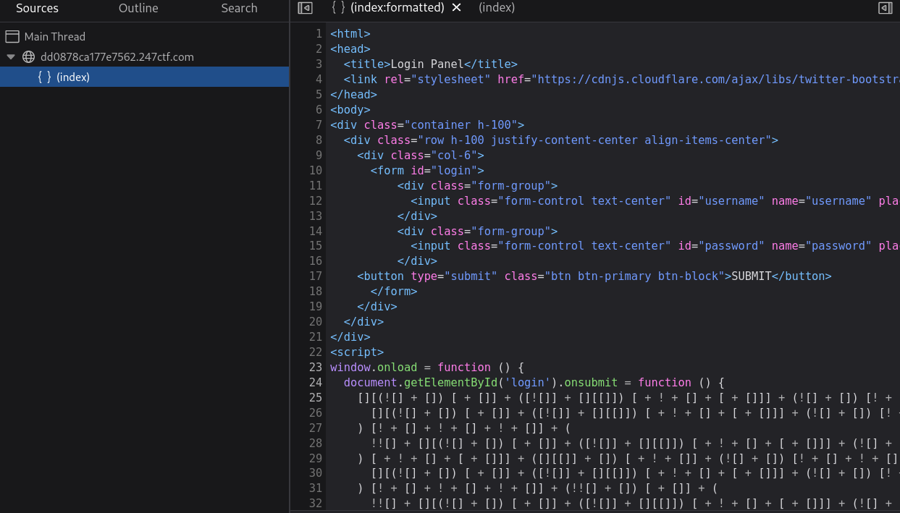
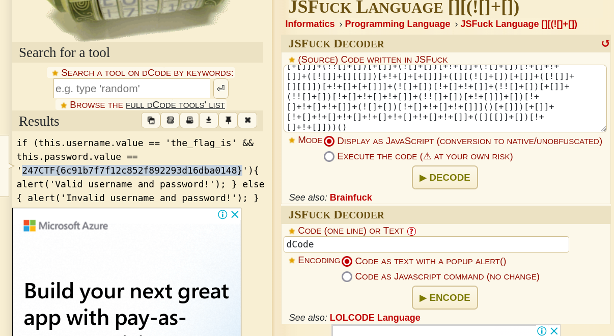

# Trusted Client - CTF Challenge Writeup

## Challenge Information
- **Name**: Trusted Client
- **Points**: 145
- **Category**: Web

## Objective
The objective of the "Trusted Client" CTF challenge is to bypass obfuscated JavaScript code and access a protected login page. Participants must analyze the provided web instance and decipher the obfuscated code to uncover the flag. This challenge falls under the Web category.

## Solution
To successfully complete the "Trusted Client" challenge, participants need to bypass the obfuscated JavaScript code used to protect a login page. Here is a step-by-step guide on how I approached and solved this challenge:

1. **Initial Web Analysis**:
   - Begin by accessing the provided web instance and inspecting the login page.
   - Open the browser's developer tools and examine the page source code.

2. **JavaScript Obfuscation**:
   - While analyzing the page source code, identify portions of JavaScript that are obfuscated.
   - In this challenge, the obfuscation technique used is a variation of the Brainfuck programming language, known as "JS Fuck Language."

       

3. **Deciphering JS Fuck Code**:
   - To make the obfuscated JavaScript code readable, use an online tool like [dcode.fr's JS Fuck decoder](https://www.dcode.fr/jsfuck-language).
   - Paste the obfuscated code into the decoder to obtain the original JavaScript.

4. **Understanding the Code**:
   - Once the obfuscated code is deciphered, study the JavaScript to understand its functionality.

      

The key to solving the "Trusted Client" challenge is deciphering the obfuscated JavaScript code, which is a variation of the Brainfuck programming language. Once the JavaScript is understood, participants can proceed to access the login page and retrieve the flag.

## Flag
The flag for this challenge is in the format `247CTF{XXXXXXXXXXXXX}`. Participants should follow the provided steps to decipher the obfuscated JavaScript code and access the protected login page, ultimately revealing the flag.
